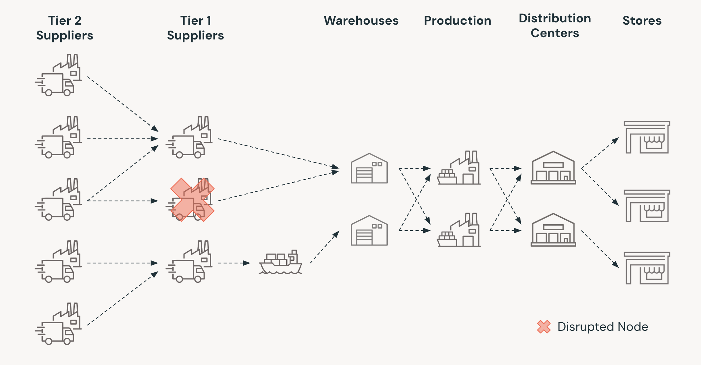

## Business Problem

Global disruptions from pandemics, wars, climate events, and cyber-attacks have exposed vulnerabilities, causing shortages, cost spikes, and reputational damage. Resilient supply chains help companies maintain service levels, capture market share when competitors falter, comply with regulations, satisfy investors’ ESG expectations, and protect revenue, margins, and brand credibility during crises.

Stress testing simulates extreme but plausible shocks—supplier failures, port closures, demand swings, geopolitical sanctions, cyber breaches—to reveal hidden dependencies and single points of failure. Quantifying impacts on cost, capacity, and service enables prioritized mitigation plans, diversified sourcing, inventory buffers, and agile decision rules, strengthening adaptability under uncertainty for future events.

This solution accelerator implements the approach proposed in a well-cited [paper](https://dspace.mit.edu/handle/1721.1/101782) that applies stress tests on a supply chain network using digital twins—virtual models built from real operational data. By simulating a range of disruption scenarios, businesses can assess potential impacts, identify vulnerabilities and make informed, proactive decisions.

At the heart of the approach is the linear optimization problem where we aim to optimize the network configuration for a common metric.

## Reference Architecture

## Authors

<ryuta.yoshimatsu@databricks.com>, <luis.herrera@databricks.com>, <puneet.jain@databricks.com>

## Project support 

Please note the code in this project is provided for your exploration only, and are not formally supported by Databricks with Service Level Agreements (SLAs). They are provided AS-IS and we do not make any guarantees of any kind. Please do not submit a support ticket relating to any issues arising from the use of these projects. The source in this project is provided subject to the Databricks [License](./LICENSE.md). All included or referenced third party libraries are subject to the licenses set forth below.

Any issues discovered through the use of this project should be filed as GitHub Issues on the Repo. They will be reviewed as time permits, but there are no formal SLAs for support. 

## License

&copy; 2025 Databricks, Inc. All rights reserved. The source in this notebook is provided subject to the Databricks License [https://databricks.com/db-license-source].  All included or referenced third party libraries are subject to the licenses set forth below.

| library                                | description             | license    | source                                              |
|----------------------------------------|-------------------------|------------|-----------------------------------------------------|
| pyomo | An object-oriented algebraic modeling language in Python for structured optimization problems | BSD | https://pypi.org/project/pyomo/
| highspy | Linear optimization solver (HiGHS) | MIT | https://pypi.org/project/highspy/